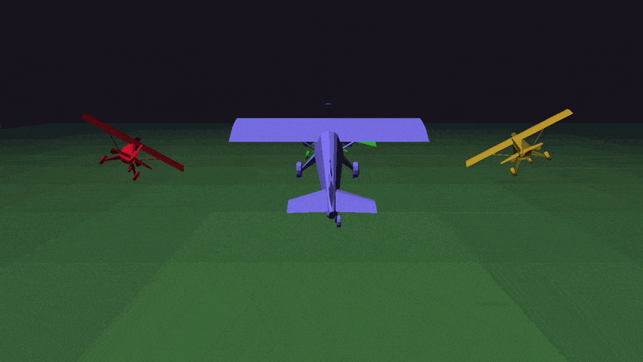
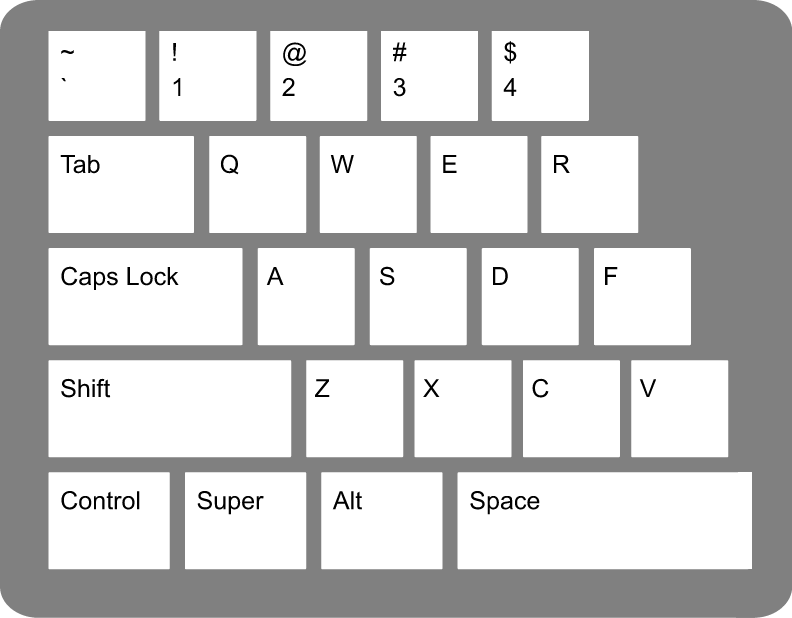

I built this simulation game based on Star Fox which i named Guaraná Horizon. Currently, it is in beta state, only with some bots with basic AI and control about the plane.
I used the plane model made by Designer Soup. [model link](https://designersoup.itch.io/low-poly-plane-pack)

## Demo


## how to use

run the executable and be happy :)

### controls


W => nose up
S => nose down
A => go to left
D => go to right
R => throttle up
F => throttle down

## how to compile

### Linux
1. Install `gcc`, `make`, and the respective SDL3 development libraries for your distro. e.g.:
   * Arch Linux: 
     ```bash
     sudo pacman -S base-devel sdl3
     ```
2. Open your terminal in the project directory and run:
   ```bash
   make
   ```

### Windows (with Visual Studio)
1. Link the appropriate SDL3 include and library paths in your project configuration.
2. Build the solution.


## what's implemented
- [x] plane rendering
- [x] 3d model of the plane
- [x] plane control
- [x] simple bot

## to do
- [ ] add networking (multiplayer)
- [ ] add weapons
- [ ] add sound
- [ ] add hud
